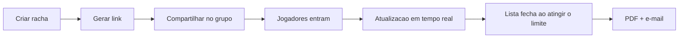

# ⚽ MeuRacha

<p align="center">
	
</p>

<p align="center">
	
	
	
	
	
</p>

> Organizar racha não precisa virar uma thread infinita no WhatsApp.
> O MeuRacha transforma essa bagunça em uma experiência simples, visual e em tempo real.

## Por que o MeuRacha existe

Todo racha tem a mesma dor: a lista começa organizada, depois vira um caos de mensagens, nomes repetidos e dúvidas sobre quem entrou primeiro. O MeuRacha resolve isso com uma página única, link compartilhável e atualização ao vivo.

## O que ele faz na prática

- Você cria o racha em menos de um minuto.
- O sistema gera um link exclusivo para compartilhar.
- Quem entrar vê a lista atualizada em tempo real.
- O horário de abertura é controlado no servidor.
- Ao atingir o limite, a lista fecha sozinha.
- No fim, o PDF é gerado e enviado por e-mail.

## O fluxo em uma imagem



## Telas principais

### Home

Uma landing page direta, com proposta clara, chamadas objetivas e foco em conversão.

### Criação do racha

Formulário com preview da abertura, validação amigável e link compartilhável logo após salvar.

### Lista do racha

Tela com status visual, ocupação da lista, contagem regressiva e feedback em tempo real.

## Diferenciais do MVP

- Visual mais limpo do que uma lista no chat.
- Ordem de chegada preservada.
- Status claro: aberta, fechada ou expirada.
- Barra de ocupação para enxergar o progresso de cara.
- Fallback pronto para produção com Vercel, Render e Supabase.
- Testes em três camadas para sustentar a evolução.

## Stack

| Camada | Tecnologia |
| --- | --- |
| Frontend | React, Vite, React Router |
| Backend | Node.js, Express |
| Tempo real | Socket.IO |
| Banco | Supabase Postgres |
| PDF | pdfkit |
| E-mail | nodemailer |
| Testes | Jest, Vitest, Testing Library, Playwright |

## Estrutura do projeto

```text
MeuRacha/
├── backend/        API REST, Socket.IO, PDF e e-mail
├── frontend/       SPA em React com Vite
├── e2e/            testes ponta a ponta com Playwright
├── DEPLOY.md       guia de deploy gratuito
└── TESTING.md      estratégia de testes
```

## Rodando localmente

### Backend

```bash
cd backend
cp .env.example .env
npm install
npm run dev
```

API em `http://localhost:3001`.

### Frontend

```bash
cd frontend
cp .env.example .env
npm install
npm run dev
```

App em `http://localhost:5173`.

## Deploy gratuito

O projeto está pronto para subir com:

- Frontend na Vercel
- Backend na Render
- Banco no Supabase

O passo a passo está em [`DEPLOY.md`](./DEPLOY.md).

## Observabilidade

O frontend já está integrado com **Vercel Analytics** para acompanhar page views e navegação depois do deploy.

Depois de publicar, basta visitar o site em produção e navegar entre as páginas para os dados começarem a aparecer no painel da Vercel.

Se os dados não surgirem em alguns segundos:

- Verifique bloqueadores de conteúdo.
- Navegue entre páginas do site.
- Confirme que o deploy publicado é o mesmo que recebeu a integração.

## Testes

A suíte está dividida em três camadas:

- Unitários
- Integração
- E2E

Detalhes em [`TESTING.md`](./TESTING.md).

Resumo rápido:

```bash
# Backend
cd backend && npm test

# Frontend
cd frontend && npm test && npm run build

# E2E
cd e2e && npm test
```

## Documentação complementar

- [`backend/README.md`](./backend/README.md)
- [`frontend/README.md`](./frontend/README.md)
- [`DEPLOY.md`](./DEPLOY.md)
- [`TESTING.md`](./TESTING.md)

## O MVP já entrega

- Lista em tempo real.
- Bloqueio por horário no servidor.
- Proteção contra nomes duplicados.
- Fechamento automático ao atingir o limite.
- Banco em produção com Supabase/Postgres.
- Publicação pronta com Vercel e Render.

## FAQ técnico

### O que acontece se 18 pessoas entrarem ao mesmo tempo?

O sistema não deve cair. O backend usa transação por racha e trava a linha do racha durante a entrada. Isso faz as requisições serem processadas de forma serializada para aquele racha.

Na prática:

- as 18 primeiras entradas válidas passam;
- a 19ª recebe resposta de lista cheia;
- o limite final permanece consistente mesmo sob concorrência.

### Existe risco de duplicar jogador ou ultrapassar o limite?

Não no fluxo normal. Há proteção de duplicidade por nome normalizado e verificação atômica do limite antes do insert.

### O analytics já está ligado?

Sim. O componente foi adicionado no frontend e passa a coletar page views após o deploy publicado.

## Próximos passos naturais

- Login do organizador.
- QR Code para compartilhamento.
- Lista de espera quando lotar.
- Histórico de rachas.
- Métricas simples de uso.

---

Se quiser, você pode seguir por [`backend/README.md`](./backend/README.md) e [`frontend/README.md`](./frontend/README.md) para entender cada camada por dentro.
